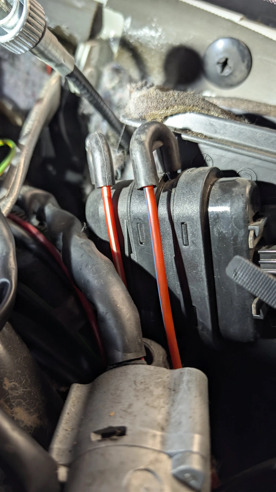

# 2026-09-27 — Dashboard removal & broken HVAC vacuum actuators

**Mileage:** 
**Topic:** climate-control
**Status:** open

## Symptom

HVAC vacuum system problems. Dashboard removed to get at the heater box actuators.
_(Add details of the original symptoms here.)_

## Procedure followed

Removed the dashboard by following the Pelican Parts guide:

- [Mercedes-Benz 190E Dashboard Removal and Replacement](https://www.pelicanparts.com/techarticles/Mercedes-190E/43-BODY-Removing_the_Dashboard/43-BODY-Removing_the_Dashboard.htm)
  ([archived, text only](https://web.archive.org/web/20170810023426/http://www.pelicanparts.com/techarticles/Mercedes-190E/43-BODY-Removing_the_Dashboard/43-BODY-Removing_the_Dashboard.htm),
  [saved copy](references/pelican-190e-removing-the-dashboard/))

Prerequisites from the guide: remove the instrument cluster and center console first, then disconnect the battery.

To go further and replace the heater core, the whole heater box has to come out. See Pelican's
[190E Heater Core Replacement](https://www.pelicanparts.com/techarticles/Mercedes-190E/44-WATER-Replacing_Your_Heater_Core/44-WATER-Replacing_Your_Heater_Core.htm)
([archived 2017](https://web.archive.org/web/20171031174919/http://www.pelicanparts.com/techarticles/Mercedes-190E/44-WATER-Replacing_Your_Heater_Core/44-WATER-Replacing_Your_Heater_Core.htm),
[saved](references/pelican-190e-heater-core-replacement/)): about 4 hours, heater core 002 835 54 01. A reader
comment recommends the genuine MB core over the narrower Nissens one, because the core's retaining nuts don't line up.
Tip from BenzWorld (MSGGrunt): removing the **steering wheel** makes it much easier to reinstall the dash.

## Vacuum diagram

Vacuum elements shown in the diagram (circled):

| Item | Element | Strokes (from switchover valve) |
|------|---------|---------------------------------|
| 37 | Blend air flaps ("cold") | single |
| 38 | Defroster outlet flaps ("closed") | **two**: 12.7 large / 12.6 short |
| 39 | Legroom flaps ("closed") | single (12.8) |
| 40 | Fresh air / recirculating air flap ("open"), on evaporator housing 34 | **two**: 12.10 large / 12.9 short |
| 41 | Heater valve ("closed"), with orifice 41a | single |

## Part list for this car

**Confirmed in the EPC for this car (catalog 452, 190 E 2.3 USA, 1988).** The four elements are:

| EPC position | Part number | EPC name |
|---|---|---|
| 83.045 Heater case with blower, **pos 38** | 201 800 08 75 | Element (round, **on top of the heater case**) |
| 83.045, **pos 59** | 000 800 87 75, alternative **201 800 05 75** | Element, defroster nozzle flap control |
| 83.045, **pos 56** | 201 800 03 75 | Element, operating unit → defroster nozzle flap, legroom |
| 83.060 A/C case with blower, **pos 53** | 201 800 00 75 | Element, main air flap control |

Source: the full parts catalog for this car, kept in the private archive (available on request).

> **Heads-up on numbering:** the vacuum diagram's *item numbers* and the parts catalog's *positions*
> are different systems. Vacuum diagram **item 38** is the defroster element, 000 800 87 75
> (WOCO 40 0104). Parts catalog **pos 38** is 201 800 08 75, the round element on top of the case.
A fifth element sits inside the heater case. It has no part number and only comes with a new case.

| # | MB part number | Function | Type | Behr / Hella cross-ref | Rebuild option |
|---|----------------|----------|------|------------------------|----------------|
| a | **201 800 08 75** | **Vacuum element on top of the heater case** (EPC 83.045 pos 38): item 37, blend air flaps | Single diaphragm, round | Label on the removed part reads **9063100055** (Behr 90.631.00.055?), dated ?/05/88 | Single-stage diaphragm, **28 mm shallow cup** (Klimakit). Cup depth measured at ~28 mm; probably the same as (c) |
| b | **000 800 87 75** | Defroster nozzle flap (item 38) | **Oval, dual-mode**: 2 stacked chambers, 2 vacuum ports, ½ open / full open | WOCO 40 0104 (molded on the housing, confirmed on the removed part). Hella 6NV 351 329-041 / 351329041 (per BenzWorld, which also gives the older MB number 201 800 05 75) | Use the seals from **2× 126 800 14 75** (same rubber, different color; Facebook 190E group) |
| c | **201 800 03 75** | Legroom flap (item 39) | Single diaphragm, round | Behr 351329721 | **9zwo8 diaphragm** (explicitly lists A2018000375, the only direct cross-reference). Klimakit single-stage 28 mm likely also fits |
| d | **201 800 00 75** | Main air flap control = fresh/recirc (item 40; EPC 83.060 pos 53) | **Double diaphragm** | Behr 90.622.00.375. Hella 6NV 351 329-301 / 351329301 | Dual-stage diaphragm cartridge, probably **clip style** (Klimakit) |

### Notes & open questions

- **(a) is item 37, the element on top of the heater case.** The EPC diagram 83.045 shows pos 38
  (201 800 08 75) mounted on top of the case. Pelican calls it "Vacuum Element - Heater Case", and
  Pelican's heater core article mentions "the vacuum element on the top of the heater box".
- MSGGrunt's 2014 parts list says "#37, #38, #39, #41 are replaceable, #40 only with the heater housing".
  That was based on a different, older diagram whose numbering probably doesn't match this one. Don't
  trust the item numbers across diagrams.
- Behr label number: this entry records what the photo shows (9063100055). An earlier note had
  906310055. Check it against the physical label.
- **Symptom of a broken defroster actuator (b):** with the A/C set to blow through the vents, the
  center vents blow cold while the side vents blow hot. A heater control valve leak can look similar.
  Source: comments on the Facebook 190E group post.
- **Access to (b):** the post's author says only the instrument cluster needs to come out, not the whole dash.
- **Rebuild notes:** the Klimakit dual-stage cartridge is sold for **Behr** actuators, so it fits (d)
  but probably not (b), which is a WOCO part. The 2× 126 800 14 75 seal fix for (b) comes from one
  owner's successful repair (with video), not from a catalog cross-reference.
- **000 800 87 75 is no longer made (NLA).** ECS and Norsider list their parts as unavailable. Rebuilding is the way forward.

Actuator (b), as removed: a rectangular/oval housing with **two stacked diaphragm chambers** and **two vacuum
ports** (one per stage), molded **"40 0104"** (WOCO part number). This matches the dual-mode defroster element
(½ open / full open) and the rebuild route of 2× 126 800 14 75 diaphragms (one per chamber).

As installed, both lines are red, connected with rubber elbows:

| Port (in photo) | Line color | Diagram code |
|-----------------|------------|--------------|
| Left  | red with a **white** stripe | **rt/ws** |
| Right | red with a **blue/violet** stripe | **rt/hbl** (red/light blue) |

These match the two colors running to item 38 in the vacuum diagram, from switchover valves 12.7
(large stroke) and 12.6 (short stroke). The diagram doesn't show which color feeds which stage.
Reconnect by color, exactly as photographed.

### Related parts (from the BenzWorld parts list, not yet verified for this car)

| Part                                   | Number          |
|----------------------------------------|-----------------|
| Switchover valve with vacuum lines     | 201 800 05 78   |
| Push-button climate control unit       | 201 830 09 85 / 88 (MSGGrunt's final fix: rebuilt 201 830 08 85) |
| Heater core                            | 002 835 54 01 (confirmed in EPC 452, 83.045 pos 26; seals 000 835 37 98 ×2) |
| Heater control valve (by battery)      | 000 830 57 84   |
| Blower motor                           | 201 820 06 42   |
| Blower speed switch                    | 201 820 17 10   |
| In-car temp sensor blower              | 000 830 19 08   |
| Air mixing flap resistor ("flap rheostat"), a common failure | 201 821 02 60 |

While the dash is out, also replace all rubber vacuum elbows/connectors and leak-test the hard lines.
MSGGrunt replaced all 4 pods, but the system only worked after a **rebuilt push-button control unit**,
so test the control unit and switchover valve too.

## Fix

_Pending._

## To do

- [ ] Double-check the Behr number on (a)'s label
- [ ] Open (a) and (c) side by side. If they're the same, one diaphragm type covers both
- [x] Cup depth of (a) measured: **~28 mm** (approximate), which is Klimakit's shallow type
- [ ] Measure the cup depth of (c) too: Klimakit sells 28 mm shallow and 33 mm deep
- [ ] Source 2× 126 800 14 75 for the (b) defroster rebuild
- [ ] Source 2× heater core water pipe seals `A 000 835 37 98` (EPC 452, 83.045 pos 30) and replace them while the dash is out. Heater core itself: `A 002 835 54 01` (pos 26, replaces `A 002 835 37 01`)
- [ ] Confirm the Klimakit dual-stage linkage type for (d) (clip vs eyelet)
- [ ] Vacuum-test each actuator and hard line before reassembly
- [ ] Test the push-button control unit + switchover valve
- [ ] Photos of each actuator in place → `images/`

## Sources

Every link has a saved copy: an Internet Archive link, or a full copy in the private archive (available on request). Each `references/` folder describes what's saved.

**Part identification / cross-reference**
- BenzWorld: [Chassis Number Help For HVAC Defrost Vacuum Actuator](https://www.benzworld.org/threads/chassis-number-help-for-hvac-defrost-vacuum-actuator.1948394/) ([saved](references/bw-chassis-number-defrost/)): source of the 4-part list and ECS's VIN lookup
- BenzWorld: [Climate Control, HVAC Restoration Parts List](https://www.benzworld.org/threads/climate-control-hvac-restoration-parts-list.1945626/) ([saved](references/bw-hvac-parts-list/))
- BenzWorld: [Vacuum Element - Defroster Nozzle Flap](https://www.benzworld.org/threads/vacuum-element-defroster-nozzle-flap.3004657/) ([saved](references/bw-defroster-nozzle-flap/)): includes a photo of all actuators with prices
- Pelican Parts: [201 800 00 75](https://www.pelicanparts.com/More_Info/2018000075.htm) ([archived 2023](https://web.archive.org/web/20230210040618/https://www.pelicanparts.com/More_Info/2018000075.htm)) · [201 800 03 75](https://www.pelicanparts.com/More_Info/2018000375.htm) ([saved](references/pelican-2018000375/)) · [201 800 08 75](https://www.pelicanparts.com/More_Info/2018000875.htm) ([saved](references/pelican-2018000875/)) · [000 800 87 75](https://www.pelicanparts.com/More_Info/0008008775.htm) ([saved](references/pelican-0008008775/))
- ECS Tuning: [000 800 87 75](https://www.ecstuning.com/b-genuine-mercedes-benz-parts/vacuum-element/0008008775/) ([saved](references/ecs-0008008775/))
- Norsider (used): [201 800 00 75 / Behr 90.622.00.375](https://autopecas.norsider.pt/en/en-heater-blower-flap-actuator-mercedes-190-201-from-1982-1983-1984-1985-1986-1987-1988-1989-1990-1991-1992-1993-2018000075-behr-90-622-00-375-199464) ([saved](references/norsider-2018000075/))
- NIParts: [201 800 00 75 → Hella 351329301](https://www.niparts.com/s_242A8B/2018000075.html) ([saved](references/niparts-2018000075/))
- DRIVE2: [A 201 800 00 75](https://www.drive2.ru/parts/mercedes/a2018000075/CUuWQEAAalk) ([saved](references/drive2-a2018000075/))
- Autoplicity: [Behr 201 800 03 75](https://autoplicity.com/3278849-behr-mercedes-201-800-03-75-vacuum-element) ([saved](references/autoplicity-2018000375/))

**Rebuild parts**
- Facebook, Mercedes 190E Owners Club: [How to repair the defroster flap vacuum element](https://www.facebook.com/groups/TheMercedes190Group/posts/10169573489405441/) ([saved](references/fb-190group-defrost/)): use 2× 126 800 14 75 seals
- Klimakit: [Single-stage diaphragms](https://klimakit.com/product/universal-single-stage-vacuum-actuator-diaphragm/) ([saved](references/klimakit-single-stage/)) · [Dual-stage cartridge](https://klimakit.com/product/dual-stage-vacuum-actuator-diaphragm-cartridge-assembly/) ([saved](references/klimakit-dual-stage/))
- 9zwo8: [Replacement diaphragm vacuum can](https://9zwo8.com/en/products/replacement-diaphragm-vacuum-can-mercedes-benz) ([saved](references/9zwo8-diaphragm/))
