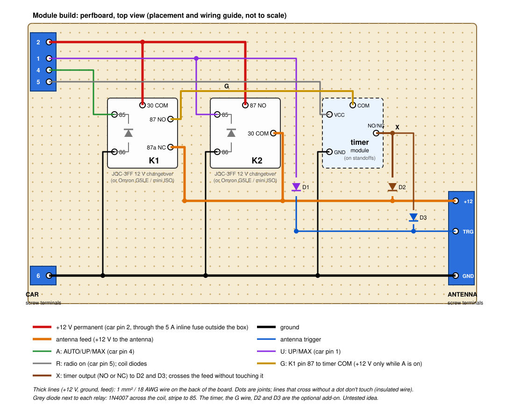
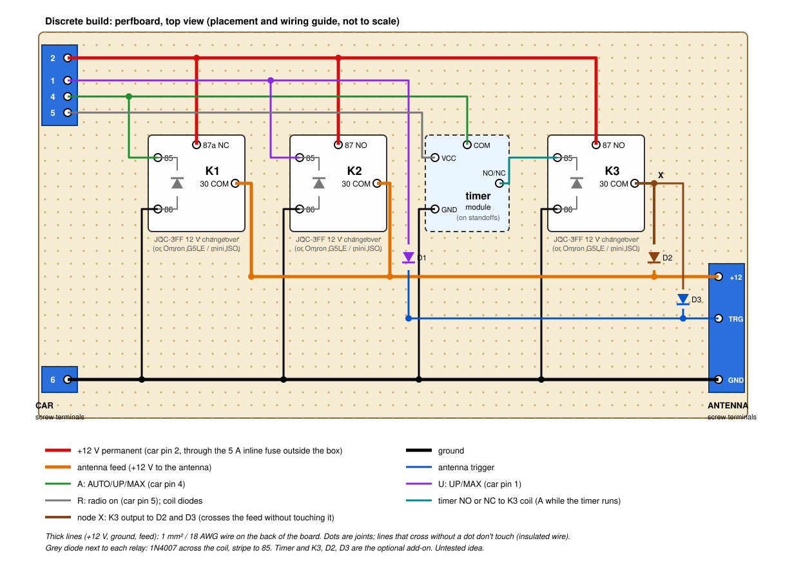
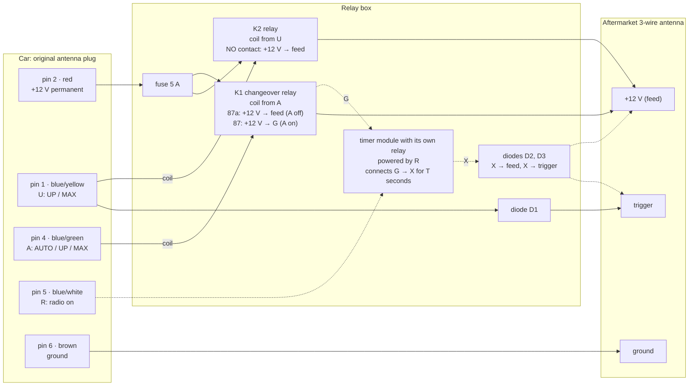
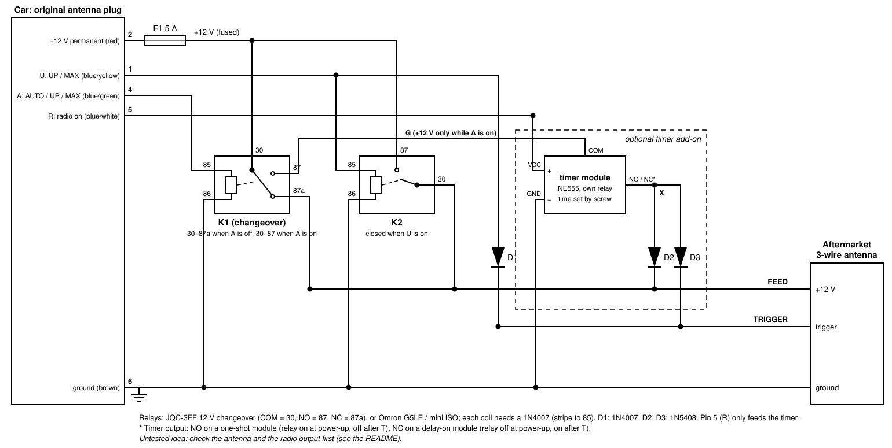
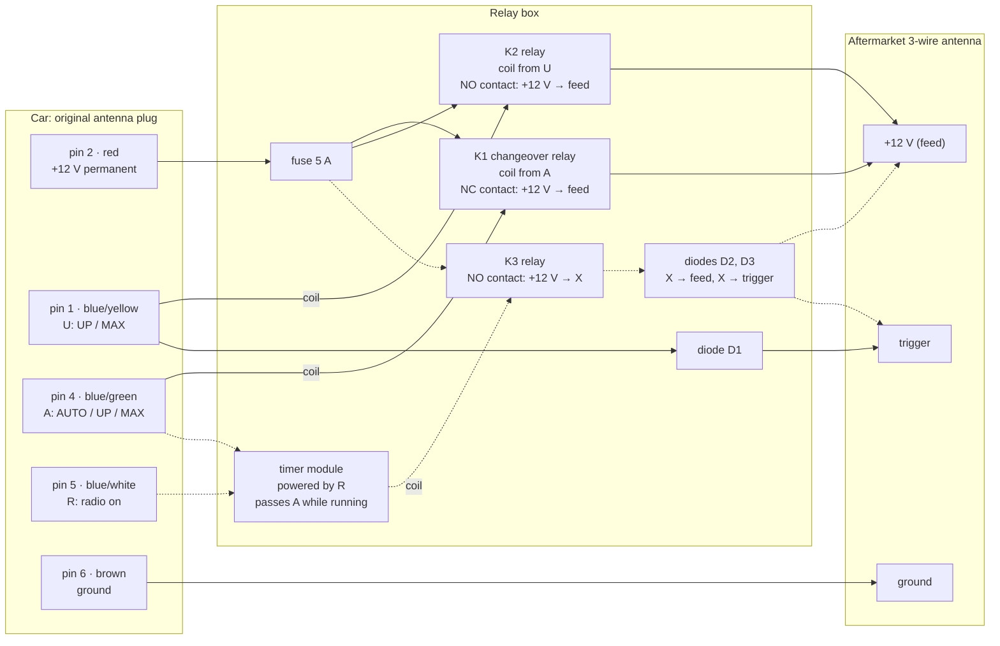
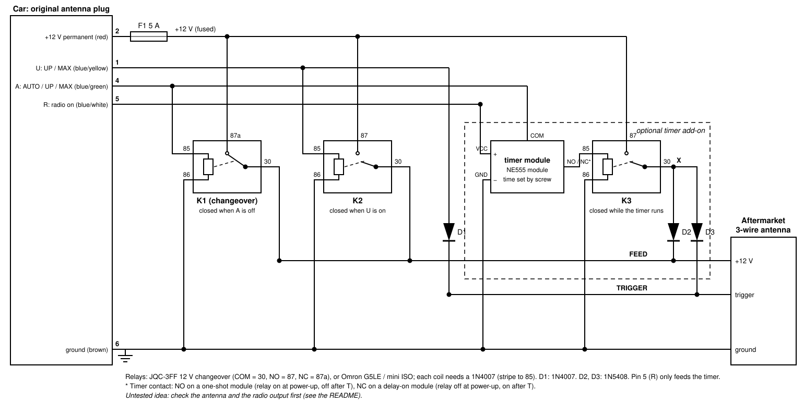

# Power antenna controller idea: relays only, no microcontroller

**System:** electrical
**Status:** untested idea

> **Untested idea.** This is a design dump, not a finished or proven build. Nothing here has been
> built or run yet. The wiring comes from documentation and forum reports. Bench-test the antenna
> first (see the [README](README.md#bench-test-the-antenna-first)) and check everything against your
> own parts.

Two ordinary automotive relays and no programming. It gives everything the original switch did
except the automatic medium height when the radio comes on; an optional timer add-on brings that
back too. How the original behaves, the car wiring and the bench tests are in the
[README](README.md).

## The logic

The [Karnaugh maps](README.md#control-logic-truth-table-and-karnaugh-maps) give:

- **Trigger = U**: the antenna goes up only when the switch is in UP or MAX.
- **Feed = ¬A + U**: the antenna gets +12 V when the switch is in OFF or DOWN, when the radio is off
  (both are ¬A), or in UP/MAX (U). In AUTO (A without U) the feed is cut, so the mast stays where it
  is.

The end stops are left to the antenna's own board, as they are today, so no current sensing is
needed.

| Situation | A | U | Feed | Trigger | Mast |
|---|---|---|---|---|---|
| Radio off (key off) | 0 | 0 | on | off | All the way down |
| OFF | 0 | 0 | on | off | All the way down |
| DOWN held | 0 | 0 | on | off | Goes down while held |
| AUTO | 1 | 0 | **off** | off | Stays where it is |
| UP held | 1 | 1 | on | on | Goes up while held |
| MAX | 1 | 1 | on | on | All the way up |

Rocking the switch to UP or DOWN and letting go now moves the mast in steps and leaves it there,
like the original. **What's missing:** when the radio comes on in AUTO, the mast stays down (it was
lowered when the radio went off). Press UP or MAX to raise it, or add the
[timer](#optional-medium-height-when-the-radio-comes-on).

## Parts

| # | Part | What for | Example |
|---|---|---|---|
| 1 | **K1: changeover relay, 12 V** (5-pin: 30, 87, 87a, 85, 86) | 30 takes the fused +12 V. 87a (closed when A is off) feeds the antenna. 87 (closed when A is on) gives the timer add-on its +12 V | See [which relays](#which-relays) |
| 2 | **K2: relay, 12 V** | Feed when U is on (normally-open contact) | Same type as K1 |
| 3 | Perfboard and screw terminals | Holds everything (the relays solder straight on); car and antenna wires go to screw terminals | See [building it on perfboard](#building-it-on-perfboard) |
| 4 | Inline blade fuse holder + 5 A fuse | Protects the +12 V permanent feed | Any automotive inline holder |
| 5 | D1: diode, 1 A or more | Stops +12 V from the timer add-on feeding back into the U switch line. Optional without the timer, **needed with it** (see [simulation](#simulation)) | 1N4007 |
| 6 | Waterproof box, wire | | See the [shopping list](#list) |

The relay coils are powered from the switch lines, which come from the radio's antenna output. A
suggested JQC-3FF relay coil draws about 30 mA (a mini ISO car relay about 150 mA), and up to two
are on at once (K1 and K2, in UP or MAX). The timer add-on is powered from the radio wire too. See
[which relays](#which-relays) for the totals, and **check what the radio's antenna output can supply**
(test in the [open questions](#open-questions-this-idea)).

Use relays with a built-in suppression diode (and connect 85/86 the right way round), or add a diode
across each coil. Without it, the coil's switch-off spike goes back into the radio's output.

## Shopping list (cheap, US prices)

Rough US prices from listings seen on 2026-10-08 (eBay US, Amazon, Walmart, Digi-Key). They change,
and most parts come in packs, so one order leaves spares.

### Which relays

**Suggested: the same relay as the timer module**, a **JQC-3FF 12 V changeover** PCB relay (the
"sugar cube" relay, for example Tongling JQC-3FF-S-Z or Hongfa JQC-3FF/12VDC-1ZS), soldered on
perfboard (see [building it](#building-it-on-perfboard)). One part type for the whole box, cheap, and
with a low coil current, which matters because the relay coils are powered from the switch lines, so
from the **radio's antenna output**.

Buy the **changeover** version: 5 pins, marked `Z` or `1ZS`. The `H` / `1HS` version has 4 pins and
no normally-closed contact, and K1 needs one.

| | **JQC-3FF 12 V changeover** (suggested) | Omron G5LE-1-E DC12 (alternative) | Mini ISO relay + PCB socket (alternative) |
|---|---|---|---|
| What it is | PCB relay, the same type as on the NE555 timer module | Brand-name PCB relay of the same size class | Standard plug-in car relay (generic "Bosch-style", or TE V23134 with built-in diode) |
| Coil current at 12 V | about 30 mA (400 Ω, 0.36 W; a 0.45 W version draws about 38 mA) | 33 mA | about 150 mA |
| Contacts | 10 A 250 VAC, up to 30 VDC | 16 A | 30/40 A |
| Temperature | −40 to +85 °C | −40 to +85 °C | −40 to +125 °C (TE) |
| Mounting | Soldered to the perfboard | Soldered to the perfboard | PCB socket soldered to the perfboard (for example Durakool DZ85AB-5-PCB); the relay unplugs |
| Price | about $0.45 each (LCSC); a few dollars for a pack on eBay | about $2.50 each (Digi-Key) | relay about $2–3 in packs; socket about €5 (RS Components) |

**Pin names:** PCB relays are labelled COM, NO and NC instead of car relay numbers. In this design
COM = 30, NO = 87, NC = 87a, and the two coil pins are 85 (+) and 86 (−).

The antenna motor draws a few amps, so all three are well oversized for the contacts. None of the
PCB relays has a suppression diode: add a 1N4007 across each coil (stripe/cathode to the + side, 85;
other end to 86). The TE mini ISO relay has it built in, so mind its polarity.

**Load on the radio's antenna output** with the suggested relays: up to two coils at once (K1 and K2
in UP or MAX), about 60–90 mA, plus the timer module (about 20 mA, plus its own relay coil) when the
add-on is fitted: roughly 100–150 mA in all. With mini ISO relays it's about 300 mA (about 400 mA
with the timer).

Other ways to mount them, if perfboard isn't wanted:

- **Relays with pigtail sockets**, joined with WAGO connectors: no board at all (5-pack of relays
  with sockets about $9–14), but messier.
- **A ready-made waterproof relay/fuse box** (about $24–76): tidy, but they usually come with 4-pin
  relays wired to the normally-open contact only. K1 needs the normally-closed contact (87a), so it
  would need a 5-pin relay and an extra wire.

### List

| Qty | Part | Search for | Rough US price |
|---|---|---|---|
| 2 (3 for the discrete build with the timer) | Relays, see [above](#which-relays): JQC-3FF 12 V **changeover** (5 pins, `Z` / `1ZS`) | "JQC-3FF-S-Z 12VDC" or "JQC-3FF/12VDC-1ZS" | about $0.45 each (LCSC); a few dollars for a pack (eBay) |
| 1 | Perfboard, about 10 × 7 cm or bigger | "perfboard" / "prototype PCB" | about $5 for a pack |
| 1 set | 5 mm PCB screw terminals (2- and 3-way), for the car and antenna wires | "5mm PCB screw terminal block" | about $5–8 for a pack |
| 1 | NE555 delay relay module, 12 V, **0–10 s** preferred (0–60 s also works) (timer add-on) | "DC 12V NE555 0-10s delay relay module" | about $1.50–3 shipped from China; about $9 plus shipping from a US eBay seller ([example](../references/ebay-ne555-0-10s-delay-relay-module/README.md)) |
| 1 | Diode assortment with 1N4007 and 1N5408 | "diode assortment kit 1N4007 1N5408 100pcs" | about $7 (Walmart) |
| 1 | Inline blade fuse holder + 5 A blade fuse | "inline blade fuse holder waterproof 5 pack" | about $10 for a 5-pack |
| 1 | Small waterproof box, with standoffs for the board | "IP65 ABS junction box" (about 120 × 80 × 60 mm or bigger) | about $7–11 |
| — | Wire (1 mm² / 18 AWG red and brown, 0.5 mm² / 20 AWG for signals), heat-shrink | | about $10, or what you have |

Timer modules come in two kinds (relay on at power-up for T, or relay on only after T); both work,
using the NO or NC contact. See [timer choices](#timer-choices-adjusted-with-a-screw) for how to tell
them apart on the bench. References: the 0–60 s board
([GRobotronics](../references/grobotronics-ne555-delay-relay-module/README.md)) and a 0–10 s board
([Phipps](../references/phipps-ne555-0-10s-delay-relay-module/README.md)).

**Rough total, from scratch:** about $35–50, timer included, with plenty left over. The parts
actually used cost about $15–25 with the suggested relays. No relay sockets are needed: the
JQC-3FF relays solder straight onto the perfboard. (Only the mini ISO alternative needs PCB sockets,
about €5 each, for example Durakool DZ85AB-5-PCB.)

### Building it on perfboard

**Module build** (suggested):



**Discrete build:**



A placement and wiring guide, not to scale. With JQC-3FF relays (about 19 × 15 mm each) the board
fits in roughly 10 × 7 cm. Check the relay footprint against the perfboard's 2.54 mm grid: PCB relay
pins usually fit, sometimes with a slight bend. (With the mini ISO alternative, its sockets are about
28 mm square, make the board bigger, and their pins may need the holes drilled out.) Pins are labelled with
both names (30 COM, 87 NO, 87a NC).

- **Power paths:** cheap perfboard copper is thin. Run the +12 V rail and the antenna feed (a few
  amps) with 1 mm² (18 AWG) wire soldered point to point on the back, not with solder bridges.
  Signal and coil connections can be thin wire.
- **Connections in and out:** 5 mm screw terminals for the car side (pins 2, 1, 4, 5, 6) and the
  antenna side (+12 V, trigger, ground), so nothing is soldered to the harness.
- **On the board:** the relays (soldered in), a 1N4007 across each coil, D1, D2 and D3. The
  timer module can sit on standoffs next to it and connect with short wires to its screw terminals.
- **In the box:** mount the board on standoffs, add strain relief where the cables enter, and keep
  the box in a dry spot in the trunk. A conformal coating on the board helps against damp.

## Wiring

### Without the timer

| From | To |
|---|---|
| Car pin 2 (+12 V permanent) | Fuse 5 A → K1 pin 30 **and** K2 pin 87 |
| Car pin 4 (A, blue/green) | K1 pin 85 (coil +) |
| Car pin 1 (U, blue/yellow) | K2 pin 85 (coil +) **and** D1 anode; D1 cathode → antenna trigger |
| K1 pin 87a **and** K2 pin 30 | Antenna +12 V (red) |
| K1 pin 87 | Not used (only by the module build of the timer add-on) |
| K1 pin 86, K2 pin 86 | Ground |
| Car pin 6 (ground) | Ground bus and antenna ground |
| Car pin 5 (R, blue/white) | Not used (only by the timer add-on) |

Relay pins use the usual automotive numbers: 85 and 86 are the coil, 30 is the common contact, 87 is
normally open and 87a is normally closed (on PCB relays: COM = 30, NO = 87, NC = 87a).

How it reads:

- K1's 30–87a contact is **closed when its coil is off**, so the antenna gets +12 V whenever A is
  off: radio off, OFF, or DOWN held. When A comes on (AUTO, UP, MAX), it opens.
- K2 closes when U is on (UP, MAX), so the antenna gets +12 V again for going up, even though K1 is
  open.
- The trigger comes straight from U, so the antenna only goes up in UP or MAX.

### With the timer: two builds

The [timer add-on](#optional-medium-height-when-the-radio-comes-on) can be built two ways. Both
behave the same and both pass the same [simulation](#simulation):

| | **Module build** (suggested) | **Discrete build** |
|---|---|---|
| Idea | Reuse what the timer module already has: its own relay switches the antenna current | Separate parts: the timer module only drives the coil of an extra relay, K3 |
| Relays | K1, K2 (and the timer module's relay) | K1, K2, K3 (and the timer module's relay) |
| Gating (timer does nothing in OFF) | K1's spare contact (87) feeds the timer's contact | The timer's contact carries the A line to K3's coil |
| Timer contact carries | Antenna motor current (a few amps; the module's relay is rated 10 A) | Only K3's coil current |
| Load on the radio output | Lower (one coil fewer) | One more relay coil |

#### Module build (suggested)

What connects to what, with each part as a box. The dotted lines belong to the timer add-on.





Added connections:

| From | To |
|---|---|
| Car pin 5 (R) | Timer module VCC; timer GND to ground |
| K1 pin 87 (node G: +12 V only while A is on) | Timer module COM |
| Timer module NO (one-shot board) or NC (delay-on board) | Node X |
| Node X | D2 anode (cathode → antenna +12 V) **and** D3 anode (cathode → antenna trigger) |

#### Discrete build





In this drawing K1's +12 V is on 87a and the feed on 30: on a changeover relay that's the same
contact as in the table above, just drawn the other way round.

Added connections:

| From | To |
|---|---|
| Car pin 5 (R) | Timer module VCC; timer GND to ground |
| Car pin 4 (A) | Timer module COM |
| Timer module NO (one-shot board) or NC (delay-on board) | K3 pin 85 (coil +); K3 pin 86 to ground |
| Fuse (+12 V) | K3 pin 87 |
| K3 pin 30 (node X) | D2 anode (cathode → antenna +12 V) **and** D3 anode (cathode → antenna trigger) |

## Optional: medium height when the radio comes on

To raise the mast part way automatically when the radio comes on in AUTO, add a timer that drives
it up for a few seconds. Wiring for both builds is [above](#with-the-timer-two-builds).

| # | Part | Example |
|---|---|---|
| 1 | 12 V timer relay module whose contact is closed for an adjustable time after it's powered (see [timer choices](#timer-choices-adjusted-with-a-screw)) | **NE555 delay relay module, 0–10 s** (trimmer screw; preferred, cheap). Finder 80.01 (dial) as a sturdier alternative |
| 2 | 2 diodes, 3 A (D2, D3) | 1N5408 |
| 3 | Discrete build only: K3, relay 12 V | Same type as K1 |

- Power the timer from **car pin 5 (R)**, so it starts every time the radio comes on. Its contact is
  closed for the first T seconds after power-up (NO or NC, see
  [timer choices](#timer-choices-adjusted-with-a-screw)).
- **Module build:** the timer module's own relay (COM, NO, NC; 10 A) switches the motor current
  itself. Its COM takes **K1 pin 87**, which is +12 V only while A is on (AUTO, UP or MAX), and its
  output is node **X**.
- **Discrete build:** the timer's contact passes **car pin 4 (A)** to **K3's coil**, and K3 switches
  the fused +12 V to node **X**. The timer's contact only carries coil current.
- Either way, X has +12 V only for the first T seconds after the radio comes on, and only if the
  switch isn't in OFF or DOWN. Feeding the timer's contact straight from the fuse would raise the
  mast for T seconds even in OFF. (Powering the timer from A instead of R would also avoid a relay,
  but then letting go of DOWN would start the timer and push the mast back up.)
- X goes through D2 to the antenna +12 V and through D3 to the antenna trigger. All three diodes are
  needed once the timer is fitted, in both builds (checked in the [simulation](#simulation)):
  - **D2** stops K1's feed from reaching the trigger, which would send the mast up instead of down.
  - **D3** stops the U line from feeding the antenna motor through D1 and D2, which would load the
    radio's output with motor current.
  - **D1** stops the timer's +12 V from feeding back into the U line (and the switch and radio).
- The time T sets the height: about half the full travel time gives about half height. It goes
  wrong if the mast wasn't fully down when the radio came on; it then ends higher, up to the top.

This adds the timer module's own current (tens of mA) to the radio's output while the radio is on.

### Timer choices (adjusted with a screw)

**Preferred: an NE555 delay relay module with a 0–10 s range**, as the cheap option. The 0–10 s
range suits an antenna that takes well under 10 s to go fully up: a full turn of the screw covers
it, so the height is easier to set than on a 0–60 s board. The Finder is the sturdier, more
expensive alternative. All of them set the time, and so the height, with a screwdriver.

What matters is a contact that is **closed for the set time after power is applied, then opens**.
NE555 boards come in two kinds, and both work if you use the right contact:

| Module behaviour at power-up | Also sold as | Use contact |
|---|---|---|
| Relay pulls in at once, releases after T | one-shot, single pulse, interval (the common 0–60 s board) | **NO** (COM–NO) |
| Relay stays off, pulls in after T and stays in | delay-on, "delay closure" (common on 0–10 s boards) | **NC** (COM–NC) |

Listings aren't always clear about which kind they are, so check on the bench: power the module
with 12 V and watch the relay LED (or listen for the click). If it clicks at once and again after T,
it's the first kind; if it clicks only after T, it's the second.

Example: the 0–10 s board in [this eBay listing](../references/ebay-ne555-0-10s-delay-relay-module/README.md)
is sold as a "delay turn-on" module, so it's the second kind: wire G to its COM and X to its **NC**.
Its own relay is a JQC-3FF-S-Z 12 V, the same as the suggested K1 and K2, and the time is set with a
multi-turn trimmer, which makes fine adjustment easy.

| | **NE555 timer relay module** (preferred) | Finder 80.01 multifunction timer (alternative) |
|---|---|---|
| What it is | Small hobby board with a relay and a blue trimmer potentiometer | Industrial timer relay for a DIN rail, 17.5 mm wide |
| Adjusting | Turn the trimmer screw; 0–10 s boards (preferred) or 0–25 s / 0–60 s | Rotary dials: one for the function, one for the time scale, one for the time |
| Mode to use | Works on power-up with no extra trigger; use NO or NC as in the table above (a few boards need a separate trigger pulse instead; avoid those) | **DI (interval)**: contact closes when powered, opens after the set time |
| Supply | 12 V DC | 12–240 V AC/DC |
| Contact | 1 changeover, about 10 A | 1 changeover, 16 A |
| Robustness | Bare board; needs the waterproof box | Industrial build, enclosed |
| Price | Cheap (about $1.50–3) | More expensive |
| Notes | A multi-turn trimmer makes fine adjustment easier | Time scales from 0.1 s up to hours; use the shortest that covers the antenna's travel time |

How to set it: time the full travel from down to up on the bench, then set the timer to the fraction
you want (half the time for about half height). The height won't be exact: the motor runs a little
faster or slower with battery voltage, temperature and how stiff the mast is.

Both have a changeover contact rated well above the antenna's few amps, so the timer's own relay
switches the antenna current directly (fed from K1 pin 87).

## Simulation

The circuit was checked with a small logic-level simulation ([relays-only-sim.py](relays-only-sim.py)). It models the netlist
from the schematic: the fused +12 V rail, the three switch lines (driven by the radio and switch, or
left open), the relay coils and contacts, the diodes (one-way), the timer (closed for T seconds after
the radio comes on) and the antenna (moves only while its +12 V is on; up with the trigger, down
without; full travel 8 s). It also flags two wiring faults: +12 V **backfeeding** into a switch
line, and a switch line (the radio's output) being able to **feed the antenna motor**.

Both builds of the timer add-on are simulated, and they give identical results.

**Result with D1, D2, D3 and the timer (T = 4 s, about half height), both builds: all 12 scenarios pass.**

| Scenario | Expected | Simulated |
|---|---|---|
| Parked, radio off | down | down |
| Radio on in AUTO (timer raises it) | 50% | 50% |
| Rock UP 1 s, release | 62% | 62% |
| Rock DOWN 2 s, release | 25% | 25% |
| MAX | up | up |
| MAX, back to AUTO | stays up | stays up |
| OFF | down | down |
| OFF, back to AUTO | stays down | stays down |
| Radio off with the mast half up | down | down |
| Radio on in OFF (timer must not raise it) | down | down |
| Radio on in MAX | up | up |
| DOWN held while the timer runs | down | down |

**Every combination.** The car can be in three states: key off, key on with the radio off (or in a
mode that switches its antenna output off, like CD or AUX on some radios), and key on with the radio
on. With the 5 switch positions that's 15 states. On this car the radio stays on for a few seconds after the key is
turned off, so the simulation keeps the radio's output on for 3 s after every key-off.

| Check | Cases | Result |
|---|---|---|
| Every change from one state to another, held long enough to settle, starting with the mast down, half up and fully up | 675 | All settle where the design says; no wiring faults |
| Every sequence of three quick changes (1 s each, so the mast is mid-travel and the timer may still be running), then key off | 10,125 | The mast always ends fully down (it starts lowering when the radio switches off, a few seconds after the key); no wiring faults |

"Where the design says": with the radio off (any switch position, key on or off) the mast goes down;
in OFF or DOWN it goes down; in UP or MAX it goes up; in AUTO it rises by the timer's amount if the
radio has just come on, and otherwise stays where it is.

The same checks fail clearly when a diode is taken out: without D2, 576 of the 675 transitions end at
the wrong height; without D1 or D3, the wiring-fault check trips (75 and 186 cases).

**Taking one diode out (timer fitted, same in both builds):**

| Missing | What goes wrong |
|---|---|
| D1 | +12 V backfeeds into the U line (and so the switch and the radio) while the timer is feeding node X |
| D2 | K1's feed reaches the trigger through D3: the mast goes **up** in OFF, DOWN and with the radio off |
| D3 | The mast still moves right, but in UP and MAX the U line (radio output) can feed the antenna motor through D1 and D2 |

**Without the timer**, D1 can be left out (nothing else drives the trigger line); everything else
behaves the same, except that the mast stays down when the radio comes on in AUTO.

What the simulation doesn't cover: real currents and voltages, relay bounce and switching times,
the timer's accuracy, and whether the antenna really stops when its +12 V is cut (bench test step 4
in the README). It checks the wiring logic, not the parts.

The script is [relays-only-sim.py](relays-only-sim.py) (Python 3, no extra libraries):

```bash
python3 relays-only-sim.py
```

## Compared with the microcontroller ideas

| | Relays only | Relays + timer | Arduino / ESP32 |
|---|---|---|---|
| UP / DOWN in steps, MAX, OFF, down with radio off | Yes | Yes | Yes |
| Medium height when the radio comes on | No | Yes, by time | Yes, by time and current |
| Stops the motor as soon as it stalls | No (the antenna's own board does it, as today) | No | Yes |
| Learns the travel time | No | No | Yes |
| Programming | None | None (set a time) | Yes |
| Parts | 2 relays | + timer module, 2 diodes | Board, sensor/shield, optocouplers, supply |
| Standby drain | None added (same as today) | None added | Almost none |
| Load on the radio's antenna output | 1–2 relay coils | + timer module | Optocoupler inputs (a few mA) and the start-up current |

## Open questions (this idea)

- [ ] What the radio's antenna output can supply (for the relay coils). Simple test: with the radio
      on, connect one relay coil (85 to the output, 86 to ground), then two. The voltage on the output
      should stay close to the battery voltage and the relays should click firmly. The suggested
      JQC-3FF relays (about 30 mA each) load it much less than mini ISO relays (about 150 mA).
- [ ] Bench test step 4 in the README: does the antenna stop when its +12 V is cut mid-travel? This
      idea depends on it as much as the others.

## References

- Phipps Electronics: 12V Adjustable 0 to 10 Second Delay Relay Module, NE555 (specs: 0–10 s by
  screw potentiometer, 10 A relay, 68 × 21 mm): [original](https://www.phippselectronics.com/product/12v-adjustable-0-10-second-delay-relay-module-ne555/)
  · [Wayback](https://web.archive.org/web/20251113230833/https://www.phippselectronics.com/product/12v-adjustable-0-10-second-delay-relay-module-ne555/)
  · [reference](../references/phipps-ne555-0-10s-delay-relay-module/README.md)

- eBay listing 226055953064: DC 12V NE555 Time Delay Relay Shield Timer Control Switch Adjustable
  Module (delay turn-on, 0–10 s, JQC-3FF-S-Z relay): [original](https://www.ebay.com/itm/226055953064)
  · [reference](../references/ebay-ne555-0-10s-delay-relay-module/README.md)
- Tongling Electronics: JQC-3FF (T73) PCB relay datasheet (contact forms, coil data, ratings):
  [original](https://atta.szlcsc.com/upload/public/pdf/source/20250908/8BE250189D647BBAA75B858103AEA1C3.pdf)
  · [reference](../references/tongling-jqc-3ff-datasheet/README.md)
- GRobotronics: Relay Module, 1 channel 12 V with adjustable delay time (NE555 delay relay module;
  how it behaves at power-up): [original](https://grobotronics.com/relay-module-1-channel-12v-with-adjustable-delay-time.html)
  · [Wayback](https://web.archive.org/web/20250813224724/https://grobotronics.com/relay-module-1-channel-12v-with-adjustable-delay-time.html)
  · [reference](../references/grobotronics-ne555-delay-relay-module/README.md)
